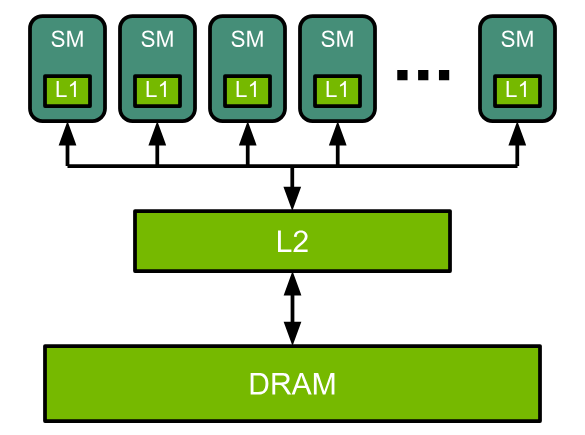
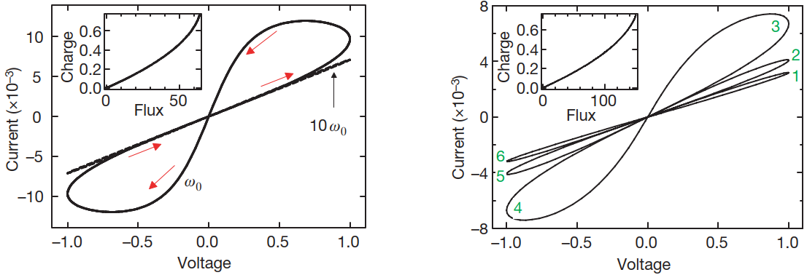
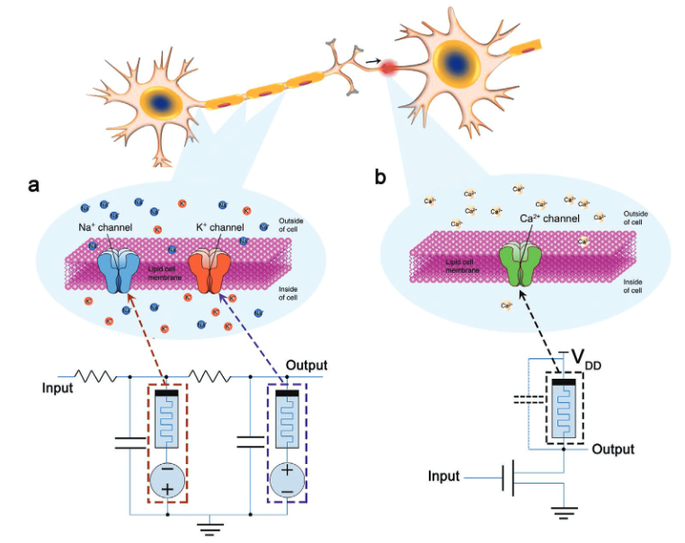
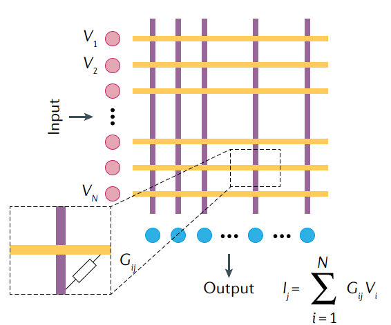
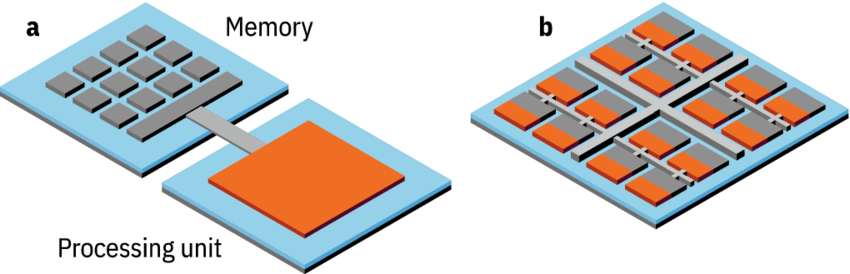

<!-- _class: cover_e -->
<!-- transition: cover -->
<!-- _paginate: "" -->
<!-- _footer:  -->
<!-- _header:  -->


# <!-- fit --> Physics for neuromorphic computing

###### Danijela Markovic, Alice Mizrahi, Damien Querlioz, et al. 


As reviewed by Chaebeom Sheen
Date: September 22nd, 2024
<cauchybs@snu.ac.kr>


---

<!-- _header: <br>CONTENTS<br>-->
<!-- transition: melt -->
<!-- _class: toc_b -->
<!-- _footer: "" -->
<!-- _paginate: "" -->

- [Introduction](#3)
- [From Von Neumann to Boltzman](#7) 
- [What are Memristors?](#11)
- [Memristor Neural Networks](#21)
- [Materials for Memristors](#26)
- [Take Home Message](#35)

## 1. Introduction

<!-- _class: trans -->
<!-- transition: melt -->
<!-- _footer: "" -->
<!-- _paginate: "" -->


## 1. Introduction

<!-- _class: navbar -->
<!-- transition: cover -->
<!-- _header: \ ***@ SNU CN*** **Introduction** *Memristors* *Materials* *Conclusion*-->

- CPUs are specialized for sequential processing of complicated tasks, making them ideal for general purpose computing.
- Meanwhile, GPUs and TPUs are specialized for parallel processing of simple tasks, making them ideal for artificial neural networks.

```python
import math

def iterative():
    sum = 0
    for i in range(1, 10**6 +1):
        sum += math.exp(-i)
    return sum
%timeit iterative()
```

Output: 102 ms ± 777 μs per loop (mean ± std. dev. of 7 runs, 10 loops each)

## 1. Introduction

<!-- _class: navbar bq-blue-->
<!-- transition: cover -->
<!-- _header: \ ***@ SNU CN*** **Introduction** *Memristors* *Materials* *Conclusion*-->
```python
# vectorized with GPU
import jax
import jax.numpy as jnp

@jax.jit
def vectorized_gpu():
    return jnp.sum(jnp.exp(- jnp.arange(1, 10**6 +1)))

vectorized_gpu() # compile the function
%timeit vectorized_gpu()
```
Output: 3.99 μs ± 116 ns per loop (mean ± std. dev. of 7 runs, 100,000 loops each)

> Note: Of course, the time difference is also due to jax's caching behavior. 

## 1. Introduction

<!-- _class: navbar-->
<!-- transition: melt -->
<!-- _header: \ ***@ SNU CN*** **Introduction** *Memristors* *Materials* *Conclusion*-->
- However, both CPUs and GPUs are based on the *von Neumann architecture*, where memory and processing are separate. The so-called *von Neumann bottleneck* is a limitation on the data transfer rate between the multi-processor and memory. (Recall $R \propto A^{-1}$)


## 2. From Von Neumann to Boltzmann

<!-- _class: trans -->
<!-- transition: melt -->
<!-- _footer: "" -->
<!-- _paginate: "" -->

## 2. From Von Neumann to Boltzman

<!-- _class: navbar col1_ol_sq fglass -->
<!-- transition: cover -->
<!-- _header: \ ***@ SNU CN*** **Introduction** *Memristors* *Materials* *Conclusion*-->

Biological brains have several properties which make them ideal for deep neural networks:

- **Massive parallelism**: the brain has 86 billion neurons, each with 10,000 synapses.
- **Adaptative learning**: the brain can learn from experience through synaptic plasticity. 
- **Low power consumption**: the brain consumes only 20 W of power, compared to 100kWh. 


## 2. From Von Neumann to Boltzman

<!-- _class: navbar col1_ol_sq fglass -->
<!-- transition: cover -->
<!-- _header: \ ***@ SNU CN*** *Introduction* **Memristors** *Materials* *Conclusion*-->

Mimicing the brain's architecture to accelerate deep neural network *training* and *inference* is the goal of neuromorphic computing. However, achieving neuromorphic isomorphism requires a fundamental shift in the way we approach computation.

- **Stochasticity**: the brain is inherently stochastic.
- **Asynchronicity**: the brain is asynchronous.
- **Plasticity**: the brain is plastic.
- **Memory in situ**: the brain has integrated memory and processing.

## 2. From Von Neumann to Boltzman

<!-- _class: navbar col1_ol_sq fglass -->
<!-- transition: melt -->
<!-- _header: \ ***@ SNU CN*** **Introduction** *Memristors* *Materials* *Conclusion*-->

Current CMOS (complementary metal-oxide-semiconductor) technology is not well-suited for neuromorphic computing. 

- **Von Neumann bottleneck**: the separation of memory and processing.
- **Bulkiness**: Processor capacity and efficiency is inherently limited by chip area. 
- **Low Interconnectivity**: Chip fan out is limited to 2-dimensions, limiting connectivity.

## 3. What are Memristors?

<!-- _class: trans -->
<!-- transition: melt -->
<!-- _footer: "" -->
<!-- _paginate: "" -->

## 3. What are Memristors?

<!-- _class: navbar cols-2-->
<!-- transition: cover -->
<!-- _header: \ ***@ SNU CN*** *Introduction* **Memristors** *Materials* *Conclusion*-->
<div class=limg>


</div>

- Theorized by Leon Chua in 1971 $^1$
- The four fundamental quantities:  $q$, $i$, $\phi$, and $v$
  - $q$: amount of charge
  - $i$: amount of current 
  - $\phi$: amount of (magnetic) flux
  - $v$: amount of voltage
- Clearly, there can be $\binom{4}{2}$ relationships between these quantities. Two relationships naturally follow from basic physics:
  - $\mathrm{d}q = i \mathrm{d}t$ (from the definition of the current)
  - $\mathrm{d}\phi = v \mathrm{d}t$ (from Faraday's law)

## 3. What are Memristors?

<!-- _class: navbar cols-2-->
<!-- transition: cover -->
<!-- _header: \ ***@ SNU CN*** *Introduction* **Memristors** *Materials* *Conclusion*-->
<div class=limg>


</div>

- The other 3 relationships follow from basic circuit elements.
  - $\mathrm{d}v = R \mathrm{d} i$ (Ohm's law)
  - $\mathrm{d}\phi = L \mathrm{d} i$ (inductance)
  - $\mathrm{d}q = C \mathrm{d} v$ (capacitance)
- However, there is no quantity that relates charge and flux. This is the memristor, described by the relationship
  - $\mathrm{d}\phi = M \mathrm{d} q$
  - with $M$ the memristance.
- Note that the memristor can be written as
  - $M = \dfrac{\mathrm{d}\phi}{\mathrm{d}q} = \dfrac{v\mathrm{d}t}{i \mathrm{d}t} = \dfrac{v}{i}$

## 3. What are Memristors?
<!-- _class: navbar-->
<!-- transition: cover -->
<!-- _header: \ ***@ SNU CN*** *Introduction* **Memristors** *Materials* *Conclusion*-->
- Trivially, if $M$ is constant, then $M \equiv R$. 
- For a simple charge-controlled memristor, where the memristance is a single-valued function of $q$,
$$ v(t) = M(q(t)) i(t) $$
- Alternatively, for a flux-controlled memristor, where memristance is a function of $\phi$,
$$ i(t) = W(\phi(t)) v(t)$$
- where $W$ is the inverse of $M$.
- $M(q)$ is referred to as the incremental memristance, and $W(\phi)$ is referred to as the incremental memductance. 
- The incremental memristance (memductance), unlike the resistance, is dependent at any time on the cumulative integral of $i$ ($v$) in the form of $q$ ($\phi$), justifying the term **mem**ristor. 


## 3. What are Memristors?
<!-- _class: navbar-->
<!-- transition: cover -->
<!-- _header: \ ***@ SNU CN*** *Introduction* **Memristors** *Materials* *Conclusion*-->
- More generally the memristance can be written as some function of state variables $x_1, x_2, \ldots, x_n$
$$ v(t) = M(x_1, x_2, \ldots, x_n, i) i(t) $$
- where the $x_i$ are described by differential equations
$$ \dfrac{\mathrm{d}x_i}{\mathrm{d}t} = f_i(x_i, i) $$
- such a expression is called the $n$-th order memristor.
- A similar process can be repeats for memductance $W(x_i)$ with $\dfrac{\mathrm{d}x_i}{\mathrm{d}t} = f_i(x_i, v)$.

## 3. What are Memristors?
<!-- _class: navbar rows-2-->
<!-- transition: cover -->
<!-- _header: \ ***@ SNU CN*** *Introduction* **Memristors** *Materials* *Conclusion*-->
- The fundamental property of passive memristors is the pinched $v-i$ hysterisis loop in the form of a Lissajous curve when driven by a bipolar periodic currrent source - i.e. it is double valued at all terms except the origin. In fact, this is considered the necessary and sufficient condition for a memristor (ideal or real). 
- Double Valued: Depending on whether $i$ is incresing or decreasing, $q$ is different for same $i$. 
- The Lissajous curve converges to a line at extremely high frequences. 

<div class = "bimg">


</div>

## 3. What are Memristors?
<!-- _class: navbar bq-green -->
<!-- transition: cover -->
<!-- _header: \ ***@ SNU CN*** *Introduction* **Memristors** *Materials* *Conclusion*-->

> Example 1: Neurons
>
> A basic example of a memristor is observed in the **Hodgkin-Huxley** circuit model:
> $\implies$ The ion flow across a potassium channel is given by $i_K = W_k(n)v_k$, 
> $\implies$ While the ion flow across a sodium channel is described by $i_{Na} = W_{Na}(m, h)v_{Na}$
> with $G_k(n) \propto n^4$ and $G_{Na}(m, h) \propto m^3h$.
> Where the $n$ and $m, h$ are known to depend on the history of the ion conductance. 
> The $g_K$ and $g_{Na}$ in fact constitute a memductance, as the conductance is dependent on the cumulative integral of the current. 

## 3. What are Memristors?
<!-- _class: navbar bq-green -->
<!-- transition: cover -->
<!-- _header: \ ***@ SNU CN*** *Introduction* **Memristors** *Materials* *Conclusion*-->

> Example 1: Neurons
>
> $\implies$ The ion flow across a potassium channel is given by $i_K = W_k(n)v_k$, 
> $\implies$ While the ion flow across a sodium channel is described by $i_{Na} = W_{Na}(m)v_{Na}$
> Specifically $\dfrac{\mathrm{d}n}{\mathrm{d}t} = \alpha(v_K)(1-n) - \beta(v_K) n$ with $\alpha(v_K)$ some fraction of the potassium channels open and $\beta(v_K)$ some fraction of the potassium channels closed.
> $\alpha(v_k) = \dfrac{0.01(v_k + E + 10)}{\exp(0.1(v_k + E + 10) - 1)}$ and $\beta(v_k) = 0.125 \exp(-0.0125(v_k + E))$
> The same equations hold for the sodium channel, with $m$ and $h$ instead of $n$. In this way, the sodium channel is called a first-order memristor (dependent on $n$) while the potassium channel is a second-order memristor (dependent on $m, h$).

## 3. What are Memristors?
<!-- _class: navbar -->
<!-- transition: cover -->
<!-- _header: \ ***@ SNU CN*** *Introduction* **Memristors** *Materials* *Conclusion*-->


## 3. What are Memristors?
<!-- _class: navbar bq-green -->
<!-- transition: melt -->
<!-- _header: \ ***@ SNU CN*** *Introduction* **Memristors** *Materials* *Conclusion*-->

> Example 2: Superconducting Josephson Junctions
>
> Another example of a memristor is observed in junctions of superconductors:
> $\implies$ $I_M = G(\gamma)V$ where $\gamma$ is the gauge-invariant phase difference across the junction.
> $\implies$ The conductance $G \approx G_{L}(1 + \epsilon \cos \gamma)$ was derived by Peotta & Ventra 
> where $\gamma$ satisfies $\dfrac{\mathrm{d}\gamma}{\mathrm{d}t} = \dfrac{2e}{\hbar}V$
> The conductance is dependent on the cumulative integral of the voltage, making it a memductance. Not only does this demonstrate that a real memristor can be used in nano-circuitry, it also indicates that advancements in materials science could lead to the development of memristors.

## 4. Memristor Neural Networks (MNNs)

<!-- _class: trans -->
<!-- transition: melt -->
<!-- _footer: "" -->
<!-- _paginate: "" -->

## 4. Memristor Neural Networks (MNNs)

<!-- _class: navbar cols-2-->
<!-- transition: cover -->
<!-- _header: \ ***@ SNU CN*** *Introduction* **Memristors** *Materials* *Conclusion*-->

- As an ion-channel is itself a memristor, it is natural to use memristors to simulate **Spiking Neural Networks** (SNNs). 
- At the neuron level, successful simulations of neuron spiking behavior (e.g. Leaky Integrate-and-Fire) have been achieved using memristors and have been used to implement Feed Forward Networks (FFNs) in combination with CMOS circuits. 
- Neuron spiking behaviors such as *all-or-nothing* and *refractory period* can be simulated using memristors.

<div class=rimg>



</div>

## 4. Memristor Neural Networks (MNNs)

<!-- _class: navbar -->
<!-- transition: cover -->
<!-- _header: \ ***@ SNU CN*** *Introduction* **Memristors** *Materials* *Conclusion*-->


## 4. Memristor Neural Networks (MNNs)

<!-- _class: navbar cols-2-->
<!-- transition: cover -->
<!-- _header: \ ***@ SNU CN*** *Introduction* **Memristors** *Materials* *Conclusion*-->

- Deep learning is $x_{n+1} = \phi(Wx_n + b)$, where $W$ is the weight matrix, $x_n$ is the input vector to the $n$-th layer, $b$ is the bias vector, and $\phi$ is the non-linear activation function.
- $i = W(\phi) v$ can be leveraged to accelerate matrix computations. 
- The voltage is taken as $x_n$, the weight matrix is taken as the analogue *memductance*, and the current is taken as the output vector $x_{n+1}$.
- As the memductance is positive, two memristors are needed to simulate a weight (one for a positive weight and one for a negative weight).


<div class=rimg>



</div>

## 4. Memristor Neural Networks (MNNs)

<!-- _class: navbar cols-2-->
<!-- transition: melt -->
<!-- _header: \ ***@ SNU CN*** *Introduction* **Memristors** *Materials* *Conclusion*-->

- Yao et al. constructed a CNN of memristors
  - 5-layer neural network
  - $8$ $128 * 16$ memristor crossbars 
  - task: classify the MNIST dataset
  - Results (vs V100 GPU)
    - achieved $96\%$ accuracy 
    - $110$ times less power draw 
    - $30$ times more performance density 
- Limitations
  - The memductance $W(\phi)$ is quantized.
  - Thus, training of convolutional weights were done ex-situ, while training of fully-connected layers and inference was done in-situ. 


<div class=rimg>


</div>

## 5. Materials for Memristors

<!-- _class: trans -->
<!-- transition: melt -->
<!-- _footer: "" -->
<!-- _paginate: "" -->

## 5. Materials for Memristors

<!-- _class: navbar col1_ol_sq fglass-->
<!-- transition: cover -->
<!-- _header: \ ***@ SNU CN*** *Introduction* *Memristors* **Materials** *Conclusion*-->
At the current stage, materials are proving to be the main bottleneck in the development of memristors. 
- **Variable Resistance with Non-volatility**: the memristor should retain its state.
- **Multiple Stable Resistance States**: The memristor should be stable in a variety of states.
- **Linear and Symmetric Tuning Behavior**: For in-situ backpropagation to be feasible. 
- **Fast and Reversible Switching**: For fast training. 
- **Scalability**: For the memristor to be economically viable, it should be able to be integrated with the CMOS fabrication and design process. 

## 5. Materials for Memristors

<!-- _class: navbar rows-2-->
<!-- transition: cover -->
<!-- _header: \ ***@ SNU CN*** *Introduction* *Memristors* **Materials** *Conclusion*-->
- Currently, no material has been found that satisfies all of these requirements. 
- One of the most promising materials are conductive-filament memristors, where a filament of metal ions is formed between two electrodes separated by an insulating oxide such as $\ce{TiO2}$ or $\ce{HfO2}$
- The filament can be formed by applying a voltage across the electrodes, and the resistance of the memristor can be tuned by changing the size of the filament.
<div class = bimg>


</div>

## 5. Materials for Memristors

<!-- _class: navbar rows-2-->
<!-- transition: cover -->
<!-- _header: \ ***@ SNU CN*** *Introduction* *Memristors* **Materials** *Conclusion*-->
- Conductive filament memristors are considered promising for their ability to emulate the long and short-term memory nature of synapses.
- If the pulses are frequent, a strong and non-volatile bridge is formed, while if the pulses are infrequent the filament is dissolved.
- Furthermore, as the material and fabrication process is compatible with the conventional CMOS process, it is considered economically viable. 

<div class = bimg>


</div>


## 5. Materials for Memristors

<!-- _class: navbar rows-2-->
<!-- transition: cover -->
<!-- _header: \ ***@ SNU CN*** *Introduction* *Memristors* **Materials** *Conclusion*-->
- Conductive filament memristors are considered promising for their ability to emulate the long and short-term memory nature of synapses.
- If the pulses are frequent, a strong and non-volatile bridge is formed, while if the pulses are infrequent the filament is dissolved.
- Furthermore, as the material and fabrication process is compatible with the conventional CMOS process, it is considered economically viable. 

<div class = bimg>


</div>


## 5. Materials for Memristors

<!-- _class: navbar rows-2-->
<!-- transition: cover -->
<!-- _header: \ ***@ SNU CN*** *Introduction* *Memristors* **Materials** *Conclusion*-->
- Chalcogenides, which are formed from crystals of chalcogen atoms (such as $\ce{Se}, \ce{Te}$) and metals ($\ce{W}, \ce{Mo}$), are also promising for their ability to form a variety of stable resistance states depending on their crystalline structure, which can be tuned by applying a voltage across the electrodes.
- The stochastic nature of the switching behavior of chalcogenides is also promising. 
- They are also relatively technologically mature, making their integration with CMOS processes relatively straightforward.

<div class = bimg>


</div>

## 5. Materials for Memristors

<!-- _class: navbar rows-2-->
<!-- transition: cover -->
<!-- _header: \ ***@ SNU CN*** *Introduction* *Memristors* **Materials** *Conclusion*-->
- Another promising alternatives are ferro-electric memristors, which are formed from ferro-electric materials such as $\ce{Pb(ZrTi)O3}$. **Ferroelectric** materials (corresponding to **Feromagnetic** materials) have a spontaneous polarization that can be reversed by the application of an electric field. 
- A major advantage of ferro-electric materials is the fact the resistive switching is purely based on electrostatics, making them stable compared to conductive filaments or chalcogenides.
- However, ferro-electric materials are not as technologically mature. 

<div class = bimg>


</div>

## 5. Materials for Memristors
<!-- _class: navbar rows-2-->
<!-- transition: cover -->
<!-- _header: \ ***@ SNU CN*** *Introduction* *Memristors* **Materials** *Conclusion*-->
- More exotic materials such as spintronic memristors, which are formed from magnetic materials such as $\ce{Fe}, \ce{Co}, \ce{Ni}$, are also being considered.
- Spintronic memristors are promising for their high cyclability, which refers to their ability ot undergo repeated switching cycles without degradation in performance.
- Accurate physical models exist for spintronic memristors, meaning the development of linear and symmetric tuning behavior is more feasible.


<div class = bimg>


</div>

## 5. Materials for Memristors
<!-- _class: navbar rows-2-->
<!-- transition: melt -->
<!-- _header: \ ***@ SNU CN*** *Introduction* *Memristors* **Materials** *Conclusion*-->
- As shown before, the Josephson junction is a memristor due to the quantization of flux within the material. This means superconducting materials are also promising for memristors.
- Single flux quantum circuits, which are formed from superconducting materials such as $\ce{YBa2Cu3O7}$ can emulate neuron spike emission and long term potentiation, with the conventional advantages of superconducting materials such as low power consumption and high speed.
- Of course, the commercial viability of superconducting materials has not yet been shown. 


<div class = bimg>


</div>

## 6. Take Home Message

<!-- _class: trans -->
<!-- transition: melt -->
<!-- _footer: "" -->
<!-- _paginate: "" -->

## 6. Take Home Message

<!-- _class: navbar rows-2-->
<!-- transition: cover -->
<!-- _header: \ ***@ SNU CN*** *Introduction* *Memristors* *Materials* **Conclusion**-->
<div class = "bimg">


</div>

- The I/O operations between the memory and CPU are both the physical and computational bottleneck in the von Neumann architecture, and a major cause of the energy inefficiency of modern computers.
- Neuromorphic computing refers to the development of computers that mimic the architecture of the brain, which is inherently parallel, asynchronous, and plastic, and analogue.
- The major characteristic of Neuromorphic computing is the integration of memory and processing, which is achieved through the use of memristors. 

## 6. Take Home Message

<!-- _class: navbar -->
<!-- transition: cover -->
<!-- _header: \ ***@ SNU CN*** *Introduction* *Memristors* *Materials* **Conclusion**-->

- Memristors are the fourth one-port passive circuit element, relating charge and flux by the equation $\mathrm{d}\phi = M \mathrm{d} q$. More commonly this is written as $i = W(x) v$ where $\dfrac{\mathrm{d}x}{\mathrm{d}t} = f(x, v)$, with $x$ the state variable and $W$ the memductance.
- Memristors can be used to simulate the behavior of neurons, whose ion channels, according to the Hodgkin-Huxley model, are memristors.
- Memristors can be used to accelerate deep learning by simulating the weight matrix in the form of an analogue memductance.
- The major bottleneck in the development of memristors is the development of materials that are stable, tunable, and scalable.
- Conductive filament memristors, chalcogenides, ferro-electric materials, spintronic materials, and superconducting materials are all promising candidates for memristors.

---

###### Q&A 
<!-- _class: lastpage-->
<!-- _footer: "" -->
<!-- _paginate: "" -->

