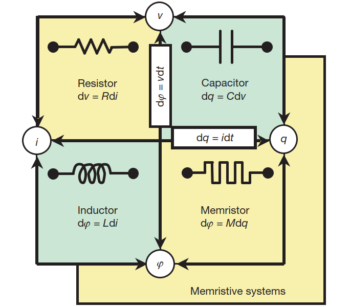

<!-- _class: cover_e -->
<!-- _paginate: "" -->
<!-- _footer:  -->
<!-- _header:  -->


# <!-- fit --> Physics for neuromorphic computing

###### Danijela Marković, Alice Mizrahi, Damien Querlioz, et al. 


As reviewed by Chaebeom Sheen
Date: September 22nd, 2024
<cauchybs@snu.ac.kr>


---

<!-- _header: <br>CONTENTS<br>-->
<!-- _class: toc_b -->
<!-- _footer: "" -->
<!-- _paginate: "" -->

- [Introduction](#3)
- [From Von Neumann to Boltzman](#7) 
- [What are Memristors?](#11)
- [Memristor Neural Networks](#17)
- [Materials for Memristors](#38)
- [From Circuits to Systems](#45)
- [Take Home Message](#48)

## 1. Introduction

<!-- _class: trans -->
<!-- _footer: "" -->
<!-- _paginate: "" -->


## 1. Introduction

<!-- _class: navbar -->
<!-- _header: \ ***@ SNU CN*** **Introduction** *Memristors* *Architectures* *Conclusion*-->

- CPUs are specialized for sequential processing of complicated tasks, making them ideal for general purpose computing.
- Meanwhile, GPUs and TPUs are specialized for parallel processing of simple tasks, making them ideal for artificial neural networks.

```python
import math

def iterative():
    sum = 0
    for i in range(1, 10**6 +1):
        sum += math.exp(-i)
    return sum
%timeit iterative()
```

Output: 102 ms ± 777 μs per loop (mean ± std. dev. of 7 runs, 10 loops each)

## 1. Introduction

<!-- _class: navbar bq-blue-->
<!-- _header: \ ***@ SNU CN*** **Introduction** *Memristors* *Architectures* *Conclusion*-->
```python
# vectorized with GPU
import jax
import jax.numpy as jnp

@jax.jit
def vectorized_gpu():
    return jnp.sum(jnp.exp(- jnp.arange(1, 10**6 +1)))

vectorized_gpu() # compile the function
%timeit vectorized_gpu()
```
Output: 3.99 μs ± 116 ns per loop (mean ± std. dev. of 7 runs, 100,000 loops each)

> Note: Of course, the time difference is also due to jax's caching behavior. 

## 1. Introduction

<!-- _class: navbar-->
<!-- _header: \ ***@ SNU CN*** **Introduction** *Memristors* *Architectures* *Conclusion*-->
- However, both CPUs and GPUs are based on the *von Neumann architecture*, where memory and processing are separate. The so-called *von Neumann bottleneck* is a limitation on the data transfer rate between the multi-processor and memory. (Recall $R \propto A^{-1}$)


## 2. From Von Neumann to Boltzmann

<!-- _class: trans -->
<!-- _footer: "" -->
<!-- _paginate: "" -->

## 2. From Von Neumann to Boltzman

<!-- _class: navbar col1_ol_sq fglass -->
<!-- _header: \ ***@ SNU CN*** **Introduction** *Memristors* *Architectures* *Conclusion*-->

Biological brains have several properties which make them ideal for deep neural networks:

- **Massive parallelism**: the brain has 86 billion neurons, each with 10,000 synapses.
- **Adaptative learning**: the brain can learn from experience through synaptic plasticity. 
- **Low power consumption**: the brain consumes only 20 W of power, compared to 100kWh. 


## 2. From Von Neumann to Boltzman

<!-- _class: navbar col1_ol_sq fglass -->
<!-- _header: \ ***@ SNU CN*** *Introduction* **Memristors** *Architectures* *Conclusion*-->

Mimicing the brain's architecture to accelerate deep neural network *training* and *inference* is the goal of neuromorphic computing. However, achieving neuromorphic isomorphism requires a fundamental shift in the way we approach computation.

- **Stochasticity**: the brain is inherently stochastic.
- **Asynchronicity**: the brain is asynchronous.
- **Plasticity**: the brain is plastic.
- **Memory in situ**: the brain has integrated memory and processing.

## 2. From Von Neumann to Boltzman

<!-- _class: navbar col1_ol_sq fglass -->
<!-- _header: \ ***@ SNU CN*** **Introduction** *Memristors* *Architectures* *Conclusion*-->

Current CMOS (complementary metal-oxide-semiconductor) technology is not well-suited for neuromorphic computing. 

- **Von Neumann bottleneck**: the separation of memory and processing.
- **Bulkiness**: Processor capacity and efficiency is inherently limited by chip area. 
- **Low Interconnectivity**: Chip fan out is limited to 2-dimensions, limiting connectivity.

## 3. What are Memristors?

<!-- _class: trans -->
<!-- _footer: "" -->
<!-- _paginate: "" -->

## 3. What are Memristors?

<!-- _class: navbar cols-2-->
<!-- _header: \ ***@ SNU CN*** *Introduction* **Memristors** *Architectures* *Conclusion*-->
<div class=limg>



</div>

- Theorized by Leon Chua in 1971 $^1$
- The four fundamental quantities:  $q$, $i$, $\phi$, and $v$
  - $q$: amount of charge
  - $i$: amount of current 
  - $\phi$: amount of (magnetic) flux
  - $v$: amount of voltage
- Clearly, there can be $\binom{4}{2}$ relationships between these quantities. Two relationships naturally follow from basic physics:
  - $\mathrm{d}q = i \mathrm{d}t$ (from the definition of the current)
  - $\mathrm{d}\phi = v \mathrm{d}t$ (from Faraday's law)

## 3. What are Memristors?

<!-- _class: navbar cols-2-->
<!-- _header: \ ***@ SNU CN*** *Introduction* **Memristors** *Architectures* *Conclusion*-->
<div class=limg>


</div>

- The other 3 relationships follow from basic circuit elements.
  - $\mathrm{d}v = R \mathrm{d} i$ (Ohm's law)
  - $\mathrm{d}\phi = L \mathrm{d} i$ (inductance)
  - $\mathrm{d}q = C \mathrm{d} v$ (capacitance)
- However, there is no quantity that relates charge and flux. This is the memristor, described by the relationship
  - $\mathrm{d}\phi = M \mathrm{d} q$
  - with $M$ the memristance.
- Note that the memristor can be written as
  - $M = \dfrac{\mathrm{d}\phi}{\mathrm{d}q} = \dfrac{v\mathrm{d}t}{i \mathrm{d}t} = \dfrac{v}{i}$

## 3. What are Memristors?
<!-- _class: navbar-->
<!-- _header: \ ***@ SNU CN*** *Introduction* **Memristors** *Architectures* *Conclusion*-->
- Trivially, if $M$ is constant, then $M \equiv R$. 
- For a simple charge-controlled memristor, where the memristance is a single-valued function of $q$,
$$ v(t) = M(q(t)) i(t) $$
- Alternatively, for a flux-controlled memristor, where memristance is a function of $\phi$,
$$ i(t) = W(\phi(t)) v(t)$$
- where $W$ is the inverse of $M$.
- $M(q)$ is referred to as the incremental memristance, and $W(\phi)$ is referred to as the incremental memductance. 
- The incremental memristance (memductance), unlike the resistance, is dependent at any time on the cumulative integral of $i$, justifying the term **mem**ristor. 


## 3. What are Memristors?
<!-- _class: navbar bq-green -->
<!-- _header: \ ***@ SNU CN*** *Introduction* **Memristors** *Architectures* *Conclusion*-->

> Example 1: Neurons
>
> A basic example of a memristor is observed in the **Hodgkin-Huxley** circuit model:
> $\implies$ The ion flow across a potassium channel is given by $i_K = \overline{g_K}n^4v_k$, 
> $\implies$ While the ion flow across a sodium channel is described by $i_{Na} = \overline{g_{Na}}m^3v_{Na}$
> The $g_K$ and $g_{Na}$ in fact constitute a memductance, as the conductance is dependent on the cumulative integral of the current. Of course, the size and shape of ion channels means they cannot be practically used in computational circuits.

## 3. What are Memristors?
<!-- _class: navbar bq-green -->
<!-- _header: \ ***@ SNU CN*** *Introduction* **Memristors** *Architectures* *Conclusion*-->

> Example 2: Superconducting Josephson Junctions
>
> Another example of a memristor is observed in junctions of superconductors:
> $\implies$ $I_M = G(\gamma)V$ where $\gamma$ is the gauge-invariant phase difference across the junction.
> $\implies$ The conductance $G \approx G_{L}(1 + \epsilon \cos \gamma)$ was derived by Peotta & Ventra. 
> The conductance is dependent on the cumulative integral of the voltage, making it a memductance. Not only does this demonstrate that a real memristor can be used in nano-circuitry, it also indicates that advancements in materials science could lead to the development of memristors.

## 4. Memristor Neural Networks (MNNs)

<!-- _class: trans -->
<!-- _footer: "" -->
<!-- _paginate: "" -->

## 4. Memristor Neural Networks (MNNs)

<!-- _class: navbar cols-2-->
<!-- _header: \ ***@ SNU CN*** *Introduction* **Memristors** *Architectures* *Conclusion*-->

- Deep learning is $x_{n+1} = \phi(Wx_n + b)$, where $W$ is the weight matrix, $x_n$ is the input vector to the $n$-th layer, $b$ is the bias vector, and $\phi$ is the non-linear activation function.
- $i = W(\phi) v$ can be leveraged to accelerate matrix computations. 
- The voltage is taken as $x_n$, the weight matrix is taken as the analogue *memductance*, and the current is taken as the output vector $x_{n+1}$.
- In this way, the memductance reflects long term potentiation (LTP) and long term depression (LTD) in the brain.

<div class=rimg>


</div>

## 4. Memristor Neural Networks (MNNs)

<!-- _class: navbar-->
<!-- _header: \ ***@ SNU CN*** *Introduction* **Memristors** *Architectures* *Conclusion*-->

## 5. Materials for Memristors

<!-- _class: trans -->
<!-- _footer: "" -->
<!-- _paginate: "" -->

## 5. Materials for Memristors

<!-- _class: navbar-->
<!-- _header: \ ***@ SNU CN*** *Introduction* **Memristors** *Architectures* *Conclusion*-->


---

###### Q&A 
<!-- _class: lastpage-->
<!-- _footer: "" -->
<!-- _paginate: "" -->

