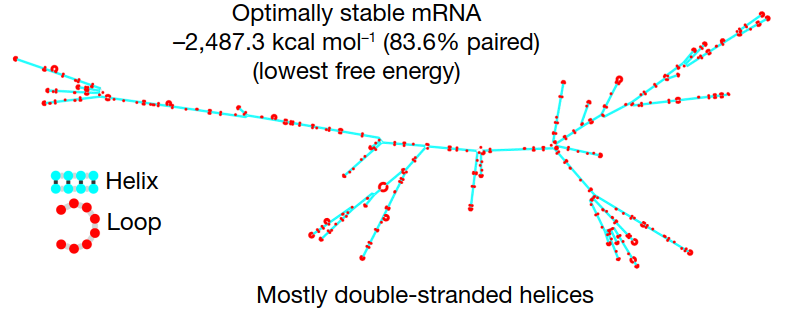
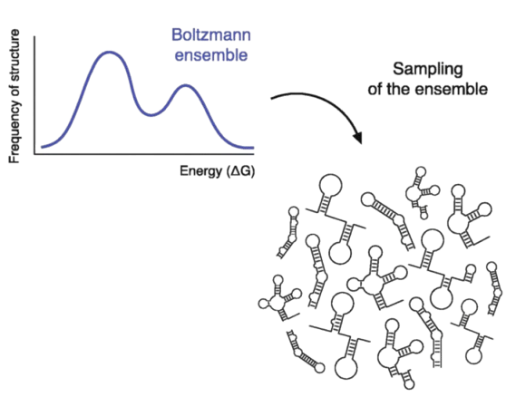
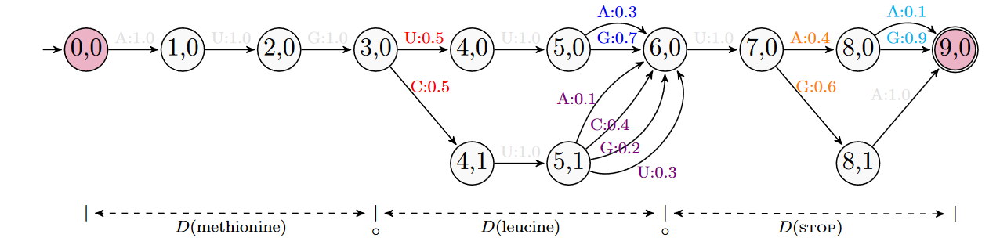
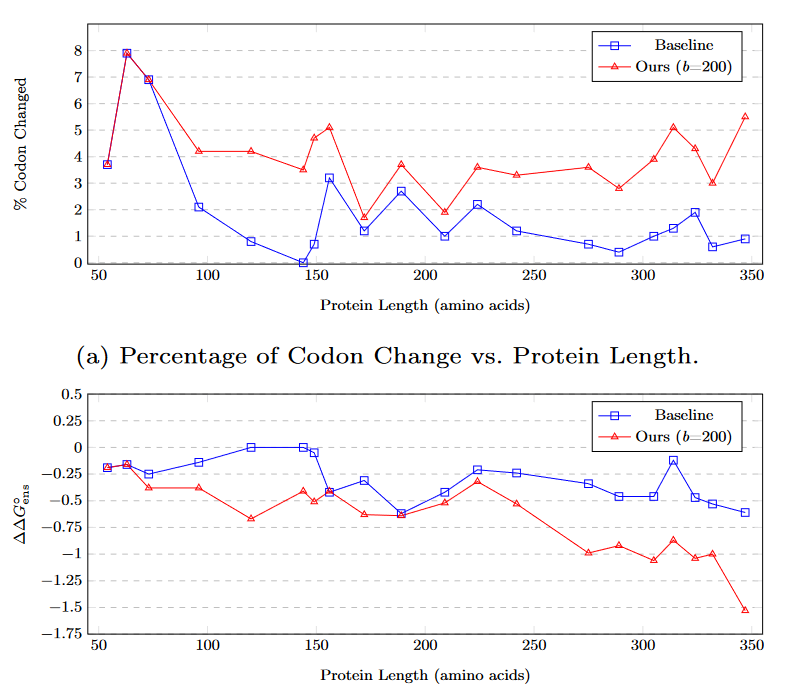
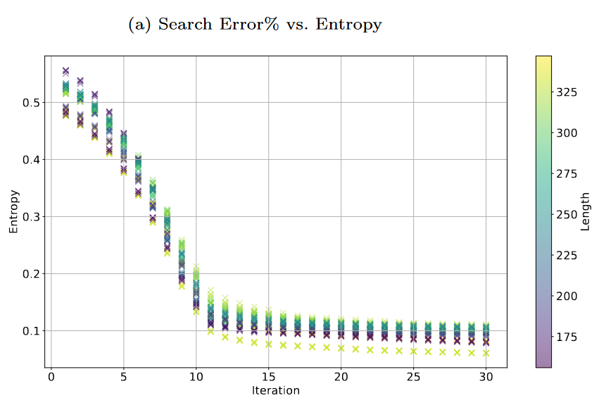

<!-- _class: cover_e -->
<!-- transition: cover -->
<!-- _paginate: "" -->
<!-- _footer:  -->
<!-- _header:  -->


# <!-- fit --> Qbio Journal Club - mRNA Design
###### via Expected Partition Function and Continuous Optimization 


By Dai N., Ting W. Y., Zhou T., et al.
submitted to $\text{arXiv}$ Dec. 29, 2023, revised Mar. 1, 2024
As reviewed by Chaebeom Sheen <cauchybs@snu.ac.kr>


---

<!-- _header: <br>CONTENTS<br>-->
<!-- transition: melt -->
<!-- _class: toc_b -->
<!-- _footer: "" -->
<!-- _paginate: "" -->

- [Introduction](#3)
- [Expected Partition Function](#6) 
- [mRNA Design Problem](#11)
- [Experimental Design and Results](#15)
- [Summary and Discussion](#20)

## 1. Introduction

<!-- _class: trans -->
<!-- transition: melt -->
<!-- _footer: "" -->
<!-- _paginate: "" -->


## 1. Introduction

<!-- _class: navbar rows-2-->
<!-- transition: cover -->
<!-- _header: \ ***@ [QBIO](#2)*** **Introduction** *Methods* *Results* *Discussion*-->

- RNA design can be categorized into two types:
  - **Design of Optimal Codon Sequence** for a given protein, in terms of factors such as stability and translatability. *LinearDeisgn* falls into this category. However, LinearDesign considers only the MFE and does not consider the entire ensemble of structures.
  - **Design of Optimal non-coding RNA** for a given function, which aims to find the RNA sequence that naturally folds into a desired structure. *Infrared* falls into this category. 

<div class = "bimg">

 <span style="font-family: Calibri; font-size: 12pt;" >Zhang H., et al. Nature 621.7978 (2023): 396-403.</span>
</div>

## 1. Introduction

<!-- _class: navbar cols-2-->
<!-- transition: melt -->
<!-- _header: \ ***@ [QBIO](#2)*** **Introduction** *Methods* *Results* *Discussion*-->

- The authors seek to translate the mRNA design problem from one of *discrete* optimization to one of *continuous* optimization.
- Take a probability distribution $\mathcal{S}$ os sequences. $\mathcal{S}$ can be expressed as a $L \times 4$ matrix with the element each row corresponding to the probability of each nucleotide. 
- Define the expected partition $\overline{\mathcal{Z}}$ over $\mathcal{S}$. Using gradient descent over $\mathcal{S}$, $\mathcal{S} \to \mathcal{S}^{*}$, with $S^{*}$ a one-hot encoding of the optimal sequence. 
- The authors apply this algorithm to achieve **ensemble free energy (EFE)** lower than LinearDesign. 

<div class = "rimg">

<span style="font-family: Calibri; font-size: 12pt;">Matthies, M. C., et al. Nucleic Acids Research 52.3 (2024) e14-e14.</span>
</div>

## 2. Expected Partition Function

<!-- _class: trans -->
<!-- transition: melt -->
<!-- _footer: "" -->
<!-- _paginate: "" -->

## 2. Expected Partition Function

<!-- _class: navbar bq-black-->
<!-- transition: cover -->
<!-- _header: \ ***@ [QBIO](#2)*** *Introduction* **Methods** *Results* *Discussion*-->

- An RNA sequence $\mathbf{x} = (x_1, x_2, \cdots, x_L)$ is a string of $L$ nucleotides, where $x_i \in \{A, C, G, U\}$.
> The Probabilistic Representation for an RNA sequence:
>
> $\mathbf{x}$ can be represented as a sample from a  probability distribution $\mathcal{S}$ written as a $L \times 4$ matrix.
> $\cdot$ with constraints $S > 0$ and $S \times \mathbf{1}_{4} = \mathbf{1}_{L}$, where $\mathbf{1}_{n}$ is the $n$-th dimensional vector of ones.
> $\cdot$ where the probability of each nucleotide is assumed to be independent. 
$$ \mathcal{S} = \begin{bmatrix} p_{1A} & p_{1C} & p_{1G} & p_{1U} \\ p_{2A} & p_{2C} & p_{2G} & p_{2U} \\ \vdots & \vdots & \vdots & \vdots \\ p_{LA} & p_{LC} & p_{LG} & p_{LU} \end{bmatrix} \tag{2.1}$$

## 2. Expected Partition Function

<!-- _class: navbar-->
<!-- transition: cover -->
<!-- _header: \ ***@ [QBIO](#2)*** *Introduction* **Methods** *Results* *Discussion*-->

- Having established a probability distribution $\mathcal{S}$, the authors define the **Expected Partition Function** $\overline{\mathcal{Z}}$ as the expected value of the partition function $\mathcal{Z}$.  
- The partition function $Z$ for a specific sequence $\mathbf{x}$ is defined as the sum of the Boltzmann factors over all possible secondary structures $y$ where $y \in \{(, ), .\}^{L}$.

$$ \mathcal{Z}(\mathbf{x}) = \sum_{y \in \mathcal{Y}} \exp(-\beta G(\mathbf{x}, y)) \tag{2.2}$$

- with $G$ the Gibbs Free Energy, $\beta = 1/kT$ the thermodynamic coldness, and $\mathcal{Y}$ the set of all valid secondary structures of $\mathbf{x}$.
- Eq. $(2.2)$ can be extended using Eq $(2.1)$ to define $\overline{\mathcal{Z}}$ as follows:

$$\begin{align}
\overline{\mathcal{Z}}(\mathcal{S}) = \mathbb{E}_{x \sim S} [\mathcal{Z}(x)] &= \mathbb{E}_{x \sim S} \left[ \sum_{y \in \mathcal{Y}} \exp(-\beta G(\mathbf{x}, y)) \right]  \\ &= \sum_{y \in \mathcal{Y}} \sum_{x \in \mathcal{S}} \prod_{1 \le i \le L} p_{ix_i} \cdot \exp(-\beta G(\mathbf{x}, y))  \tag{2.3}
\end{align}$$

## 2. Expected Partition Function

<!-- _class: navbar-->
<!-- transition: cover -->
<!-- _header: \ ***@ [QBIO](#2)*** *Introduction* **Methods** *Results* *Discussion*-->

- The authors provide the following pseudocode for the calculation of $\overline{\mathcal{Z}}$ using the Nussinov model
- The Nussinov model is a simplified model for approximating the energy of a secondary structure. 
- It depends only on $20$ parameters:
  - $\delta = (\delta_{A}, \delta_{C}, \delta_{G}, \delta_{U})$ 
  - $\xi = \begin{pmatrix} \xi_{AA} & \xi_{AC} & \xi_{AG} & \xi_{AU} \\ \xi_{CA} & \xi_{CC} & \xi_{CG} & \xi_{CU} \\ \xi_{GA} & \xi_{GC} & \xi_{GG} & \xi_{GU} \\ \xi_{UA} & \xi_{UC} & \xi_{UG} & \xi_{UU} \end{pmatrix}$ 
- Translating the Nussinov model to the Turner model is a non-trivial task and is not covered by the authors, nor implemented in their current [code](https://github.com/KuNyaa/RNA_Design_codebase). [Memory](https://github.com/rkruegs123/jax-rnafold) might be the bottleneck for a practical implementation of the Turner model.

## 2. Expected Partition Function

<!-- _class: navbar -->
<!-- transition: melt -->
<!-- _header: \ ***@ [QBIO](#2)*** *Introduction* **Methods** *Results* *Discussion*-->
```python
def ExPartition(S):
    L = S.shape[0]
    S_pair = np.einsum('ik,jl->ijlk', S, S)
    Z = np.eye(N = L, k = -1)
    for j in range(L):
        Z[:, j] += Z[:, j - 1] * (S[j, :] @ np.exp(-BETA * DELTA).T)
        Z[:, j] += (Z[:, :-2] @ Z[2:, j-1]) * np.sum(
          S_pair[1: L - 1, j, :, :] * np.exp(
            - BETA * XI
          ))
    return Z
```
- The code has $\mathcal{O}(L^3)$ time complexity and $\mathcal{O}(L^2)$ space complexity. Applying beam search to the search space reduces the time complexity to $\mathcal{O}(Lb^2)$.

## 3. mRNA Design Problem

<!-- _class: trans -->
<!-- transition: melt -->
<!-- _footer: "" -->
<!-- _paginate: "" -->

## 3. mRNA Design Problem

<!-- _class: navbar cols-2-->
<!-- transition: cover -->
<!-- _header: \ ***@ [QBIO](#2)*** *Introduction* **Methods** *Results* *Discussion*-->

- The limitation of *LinearDesign* was the fact that it only considered the $\text{MFE} = \min_{y \in \mathcal{Y}} \Delta G(y)$. 
- While the MFE is the most stable structure, there are multiple quasi-stable structures that are not considered in LinearDesign. 
- The authors propose maximizing the Ensemble Free Energy (EFE) as a more accurate measure of stability. From thermodynamics, it is known that $\text{EFE}(\mathcal{S}) = \mathbb{E}_{s \sim \mathcal{S}, y \sim \mathcal{Y}} \Delta G (s, y) = -kT \log \overline{\mathcal{Z}}$. 
- Thus minimizing the EFE is equivalent to maximizing $\overline{\mathcal{Z}}$.

<div class = "rimg">

 <span style="font-family: Calibri; font-size: 12pt;">Aviran S. Journal of Molecular Biology 434.18 (2022): 167635.</span>
</div>

## 3. mRNA Design Problem

<!-- _class: navbar rows-2-->
<!-- transition: cover -->
<!-- _header: \ ***@ [QBIO](#2)*** *Introduction* **Methods** *Results* *Discussion*-->

- To apply gradient descent over $S$ in mRNA design problem, we need to define a way to transform $\mathbf{aa} = (aa_1, aa_2, \cdots, aa_L)$, a string of $L$ amino acids, to $\mathcal{S}$, a distribution over sequences.
- The representation cannot be done by means of a matrix, as the probability of nucleotide at each position is not independent d/t degenerate amino-acids, e.g. Arginine and Leucine, and STOP.  
- $\mathcal{S}$ is represented by a probabilistic DFA (Discrete Finite Automata), à la [LinearDesign](https://github.com/LinearDesignSoftware/LinearDesign).
- In this representation of $\mathcal{S}$, each node is associated with a distribution, and each transition is associated with the probability of the admissable nucleotide. 

<div class = "bimg">

 
<span style="font-family: Calibri; font-size: 12pt;"> Dai N., et al. arXiv preprint arXiv:2401.00037v2 (2024) .
</span>
</div>

## 3. mRNA Design Problem

<!-- _class: navbar-->
<!-- transition: melt -->
<!-- _header: \ ***@ [QBIO](#2)*** *Introduction* **Methods** *Results* *Discussion*-->

- Calculation of $\text{EFE}$ for a $\text{DFA}$ is similar for general RNA sequences, with the exception that the sum over all sequences is replaced by the sum over all transitions in the DFA.
- Again, the Nussinov model is used to calculate the Gibbs Free Energy of a secondary structure.
- With a valid probabilistic DFA representation $\mathcal{S}$ and a differentiable loss function $\text{EFE}$, the authors apply projected gradient descent to optimize $\mathcal{S}$. 
- **Projected** gradient descent is necessary to ensure that $p_{iA} + p_{iC} + p_{iG} + p_{iU} = 1$ for $p_i > 0$. 
  -  First, gradient descent $S_{t+1}^{\prime} = S_t - \eta \nabla \text{EFE}(S_t)$ is performed.
  -  Second, the projection step is performed where $N$ is the number of transitions in the DFA.
  $$S_{t+1} = \text{argmin}_{S} \left\{ \| S - S_{t+1}^{\prime} \|_2^2 \mid S > 0, S \times \mathbf{1}_{4} = \mathbf{1}_{N} \right\}$$
  - This process is repeated until convergence to a one-hot encoding of the optimal sequence.


## 4. Experimental Design and Results

<!-- _class: trans -->
<!-- transition: melt -->
<!-- _footer: "" -->
<!-- _paginate: "" -->

## 4. Experimental Design

<!-- _class: navbar-->
<!-- transition: cover -->
<!-- _header: \ ***@ [QBIO](#2)*** *Introduction* *Methods* **Results** *Discussion*-->
- The authors compared the EFE of their method to that of LinearDesign on a set of $20$ random protein sequences from [UniProt](https://www.uniprot.org/). The sequences are between $50$ and $350$ amino acids long. 
- $\mathcal{S}$ is initialized with the minimal free energy sequence of the protein from **LinearDesign**. Taking $\mathcal{S}_0$ as the MFE solution leads to it being trapped, $(1- \epsilon) \mathcal{S} + \epsilon \mathcal{S}_{\text{rand}}$ is used with $\epsilon = 0.5$.
- $30$ iterations of gradient descent are performed with a learning rate of $1$ and beam size of $100$. 
- This is compared to a Random Walk (RW) baseline, where $\mathcal{S}$ is initialized with the same $\mathcal{S}_0$ as LinearDesign, and a random codon is selected at each iteration given a lower $-RT \log \mathcal{Z}$. 
  - $100$ iterations are performed.
- Evaluation is done by **LinearPartition**, with options `-V -b0`. 

## 4. Results: Gradient Descent Outperforms Random Walk

<!-- _class: navbar cols-2-->
<!-- transition: cover -->
<!-- _header: \ ***@ [QBIO](#2)*** *Introduction* *Methods* **Results** *Discussion*-->

<div class = "limg" >

 <span style="font-family: Calibri; font-size: 12pt;"> Dai N., et al. arXiv preprint arXiv:2401.00037v2 (2024) .
</span>
</div>

- It is observed that the projected gradient descent method has a considerably wider search space than the random walk method. 
- Furthermore the decrease in EFE is greater for the gradient descent method than for the random walk method.

## 4. Results: Beam Search Error Correlates with Entropy

<!-- _class: navbar cols-2-->
<!-- transition: cover -->
<!-- _header: \ ***@ [QBIO](#2)*** *Introduction* *Methods* **Results** *Discussion*-->
<div class = "limg" >

<span style="font-family: Calibri; font-size: 12pt;"> Dai N., et al. arXiv preprint arXiv:2401.00037v2 (2024) .
</span>
</div>

- With the classic Shannon entropy, the authors find that the level of entropy decreases as $S$ converges. 
- The error from beam search is measured by comparing the results with $b = 100$ and $b = \infty$. 
- The authors find that the error from beam search is correlated with the level of entropy. 

## 4. Results: Gradient Descent for Longer Sequences

<!-- _class: navbar rows-2-->
<!-- transition: melt -->
<!-- _header: \ ***@ [QBIO](#2)*** *Introduction* *Methods* **Results** *Discussion*-->
- The authors find that the gradient descent may converge to a suboptimal solution for longer sequences. 
- Even for longer sequences, the decrease in EFE is small 
  - absolute difference of $< 1 \text{kcal}/\text{mol}$
  - relative difference of $< 0.16\%$. 


<div class = "bimg">

  
<span style="font-family: Calibri; font-size: 12pt;"> Dai N., et al. arXiv preprint arXiv:2401.00037v2 (2024) .
</span>
</div>

## 5. Summary and Discussion

<!-- _class: trans -->
<!-- transition: melt -->
<!-- _footer: "" -->
<!-- _paginate: "" -->

## 5. Summary

<!-- _class: navbar -->
<!-- transition: cover -->
<!-- _header: \ ***@ [QBIO](#2)*** *Introduction* *Methods* *Results* **Discussion** -->

- The authors propose a novel method for mRNA design that translates the problem from one of discrete optimization to one of continuous optimization.
- The authors define the Expected Partition Function $\overline{\mathcal{Z}}$ and apply gradient descent to optimize $\mathcal{S}$, a probability distribution over sequences either in the form of a $L \times 4$ matrix or a probabilistic DFA.
- The authors show that their method outperforms LinearDesign in terms of EFE, and that the error from beam search is correlated with the level of entropy.

## 5. Discussion

<!-- _class: navbar-->
<!-- transition: cover -->
<!-- _header: \ ***@ [QBIO](#2)*** *Introduction* *Methods* *Results* **Discussion** -->

- Would an implementation of the Turner model be needed or feasible for practical applications?
  - A similar paper implementing the Turner model failed for sequences longer than $50$ nucleotides due to memory constraints. 
- Is a decrease of $< 1 \text{kcal}/\text{mol}$ in the Energy Free Ensemble significant?
- Is the random walk baseline fair? 
- Is the error from beam search a significant issue?
- How low should the entropy be before convergence?
- Is dual optimization possible?
  - It is trivial to define an expected $\text{CAI}$ based on the geometric mean over the probabilistic DFA. 

---

###### Q&A 
<!-- _class: lastpage-->
<!-- _footer: "" -->
<!-- _paginate: "" -->
